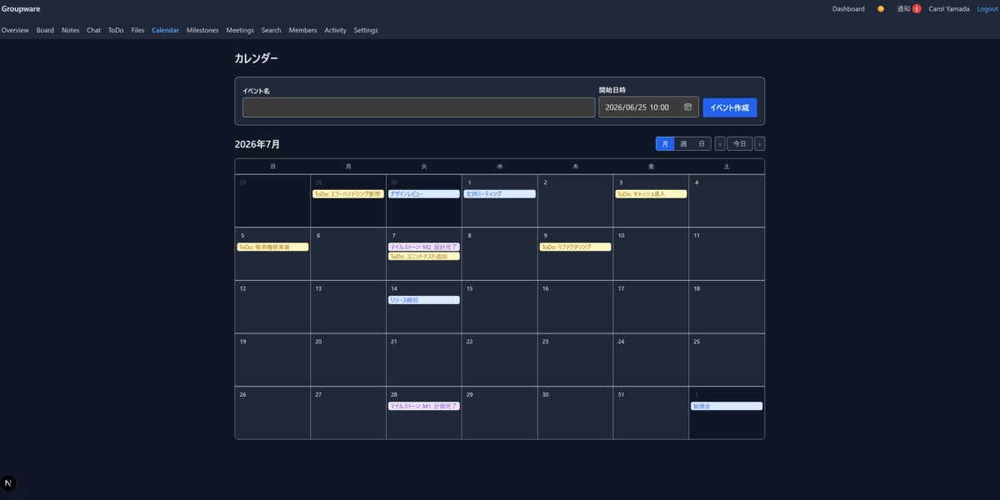

# OpenGroupware



OpenGroupware is a full-featured, self-contained, project-based groupware built with **Next.js 15**,
**TypeScript**, and **SQLite**. It runs entirely on Node.js — no external database, cache, or object
storage — and packs boards, realtime chat, a Kanban ToDo board, Markdown notes, file sharing, a
calendar with milestones, meetings with schedule-conflict detection, search, dashboards,
notifications, and admin backups into a single deployable app.

> **Origin:** This project was built as a test of **GLM-5.2** with **OpenCode**. The vast majority of
> the codebase was generated autonomously, without human interaction. Total usage: ~4M input tokens,
> ~800K output tokens, ~**$82** in API cost.

## Features

- **Project workspaces** — multi-project, with member roles (admin / member / guest) and permission-checked access throughout
- **Boards** — threaded discussions with Markdown, categories, pinning, important flags, and file/image attachments
- **Realtime chat** — per-project SSE live messages with @mentions and attachments (auto-reconnect via `EventSource`)
- **Kanban ToDo board** — drag-and-drop columns & cards, priorities, assignees, start/due dates, tags, milestones, and attachments
- **Markdown notes** — pinned notes, tags, full search, and sanitized rendering
- **File sharing** — uploads with a lightbox, library + attachment sources, and project-scoped storage
- **Calendar** — month/week/day views with events linked to todos, milestones, and meetings
- **Milestones** — due dates, status, and progress roll-up across todos
- **Meetings** — agenda & minutes (Markdown), invited members, and schedule-conflict detection
- **Search & dashboards** — cross-project search and a personal dashboard
- **Notifications & activity log** — mentions, assignments, due-soon, and meeting invites, plus a per-project audit trail
- **Admin tools** — one-click backup (SQLite DB + uploads → ZIP), download, and migration status (system_admin only)
- **Auth** — bcrypt password hashing, stateless signed-cookie sessions, and system_admin / member roles
- **PWA & mobile** — installable, responsive, with an offline shell
- **Theme & i18n** — dark/light theme and English / Japanese UI

## Tech Highlights

- **Strict layered architecture** — `UI (app/) → Service (services/) → Repository (repositories/) → Data (lib/db/)`; one-way dependencies, SQL isolated in repositories
- **Realtime via SSE** — a tiny in-memory `SseHub` (`lib/sse/hub.ts`) broadcasts events to per-project clients; services inject the hub and fire events on writes
- **Custom SQL migration system** — `Migrator` (`lib/db/migrator.ts`) applies versioned `lib/db/migrations/NNN_*.sql` files in filename order, each in its own transaction and recorded in `schema_migrations` — no ORM, no external CLI
- **SQLite wrapper** — `SqliteDatabase` centralizes `better-sqlite3` access with WAL mode, `foreign_keys = ON`, parameter binding, and transactions; repositories never touch the driver directly
- **Stateless signed sessions** — `base64url(payload).base64url(hmacSha256(secret, payload))` cookies verified with `crypto.timingSafeEqual` and an `iat` expiry
- **Playwright E2E tests** — `webServer` auto-runs `migrate && dev`, a `globalSetup` seeds the admin account, `workers: 1` for deterministic SSE; 15 specs cover every major user flow
- **Vitest unit & integration tests** — 326 tests across 38 files using a real temporary SQLite DB per test, with an 80% coverage threshold on repositories and services
- **Soft deletes everywhere** — `deleted_at IS NULL` filtering enforced in repository queries
- **XSS-safe Markdown** — `react-markdown` + `remark-gfm` + `rehype-sanitize`; HTML and dangerous URL schemes are stripped
- **Key algorithms, unit-tested** — schedule-conflict detection, milestone progress calculation, notification targeting, and session-token verification
- **Spec-driven workflow** — opencode-driven design docs (`docs/`) and per-task steering files (`.steering/`) keep planning and implementation traceable

The codebase follows a strict **layered architecture**:

```
UI (app/) → Service (services/) → Repository (repositories/) → Data (lib/db/)
```

Dependencies flow one direction only; SQL is always parameter-bound and accessed through the
`SqliteDatabase` wrapper (never `better-sqlite3` directly in repositories).

---

## Table of Contents

- [Prerequisites](#prerequisites)
- [How to Start](#how-to-start)
- [How to Test](#how-to-test)
- [How to Develop](#how-to-develop)
- [Environment Variables](#environment-variables)
- [Project Structure](#project-structure)
- [npm Scripts Reference](#npm-scripts-reference)
- [Troubleshooting](#troubleshooting)
- [License](#license)

---

## Prerequisites

- **Node.js** v24.11.0 (LTS; v18+ works) — the dev container pins this version
- **npm** 11.x (bundled with Node.js)
- **Playwright browsers** for E2E tests (see [How to Test](#how-to-test))

A Dev Container configuration (`.devcontainer/`) is included for VS Code.

---

## How to Start

```bash
# 1. Install dependencies
npm install

# 2. Create your local environment file
cp .env.example .env
#   Edit .env if you want to change SQLITE_PATH / SESSION_SECRET / UPLOADS_PATH.
#   SESSION_SECRET is required — the app will not start without it.

# 3. Initialize the database (runs all SQL migrations)
npm run migrate

# 4. Start the development server
npm run dev
```

The app is then available at **http://localhost:3000**.

- The first user you register becomes a regular `member`. To use admin features
  (backups, migration status), promote a user to `system_admin` in the DB, or seed one:
  ```bash
  npx tsx -e "import('./lib/db/sqlite.ts').then(async m => { \
    const { UserRepository } = await import('./repositories/UserRepository.ts'); \
    const bcrypt = (await import('bcrypt')).default; \
    const db = new m.SqliteDatabase(process.env.SQLITE_PATH ?? './data/app.db'); \
    new UserRepository(db).create({ name:'Admin', email:'admin@example.com', \
      passwordHash: bcrypt.hashSync('admin123', 10), role:'system_admin' }); db.close(); })"
  ```
- The SQLite database lives at `./data/app.db` (and uploads under `./data/uploads/`). Both are
  git-ignored. Deleting `./data/` and re-running `npm run migrate` gives a clean slate.

### Production build

```bash
npm run build
npm run start      # serves the optimized build on http://localhost:3000
```

---

## How to Test

There are three test layers: **Unit/Integration** (Vitest) and **E2E** (Playwright).

### Unit & integration tests (Vitest)

```bash
npm test                 # run all unit/integration tests once
npm run test:watch       # watch mode
npm run test:coverage    # run with coverage (threshold: 80% for repositories/** + services/**)
```

These use a real temporary SQLite database per test (see `tests/helpers/db.ts`) and cover every
Repository, Service, and the key algorithms (schedule-conflict, milestone progress, session tokens,
notification targeting).

### End-to-end tests (Playwright)

```bash
npm run test:e2e         # run the full E2E suite (headless)
npm run test:e2e:ui      # interactive UI mode — test tree + per-step screenshots/traces
```

Before running E2E:

```bash
# Install the Chromium browser once (per machine)
npx playwright install chromium
```

How E2E works:
- Playwright's `webServer` runs `npm run migrate && npm run dev` automatically, so the DB is
  initialized and the dev server is started for you.
- A `globalSetup` (`tests/e2e/globalSetup.ts`) seeds an `admin@example.com` / `admin123`
  (`system_admin`) account used by the admin/backup tests.
- The suite runs with `workers: 1` for deterministic behavior (the realtime SSE test needs low
  contention against the single dev server).
- E2E specs live in `tests/e2e/*.spec.ts` (auth, project-management, board, notes, chat-sse,
  todo-kanban, file-sharing, calendar, meetings, search/dashboard, notifications, activity-log,
  backup).

### Lint, type-check, build

```bash
npm run lint
npm run typecheck
npm run build
```

Run all three green before committing. A pre-commit hook (Husky + lint-staged) auto-fixes and
formats staged files.

### Recommended full check before opening a PR

```bash
npm run lint && npm run typecheck && npm test && npm run build && npm run test:e2e
```

---

## How to Develop

### Typical workflow

1. Branch from `main`: `git checkout -b feature/<name>` (or `fix/`, `refactor/`).
2. Implement following the layered architecture and coding conventions (see
   `docs/development-guidelines.md`):
   - Route handlers in `app/api/.../route.ts` start with `export const runtime = 'nodejs';` (Edge
     runtime is forbidden because of better-sqlite3).
   - Services do permission checks and call repositories; repositories hold SQL and use parameter
     binding (`@param`) and `deleted_at IS NULL` for soft-deleted tables.
   - Map DB `snake_case` columns to camelCase entity fields in repository mappers.
   - All list endpoints paginate (`LIMIT`/`OFFSET`).
3. Add Unit tests for any new Repository/Service, and an E2E spec for user-facing flows.
4. Ensure `npm run lint`, `npm run typecheck`, `npm test`, and `npm run build` are green.
5. Merge to `main` (merge commit). Milestones in this project were delivered one per branch, each
   merged to `main` before the next branched off.

### Database migrations

Migrations are plain SQL files in `lib/db/migrations/`, named `NNN_description.sql` and run in
filename order. Each file runs in its own transaction and is recorded in `schema_migrations`.

```bash
npm run migrate          # apply pending migrations
```

To add a schema change, create e.g. `lib/db/migrations/002_add_column.sql` and re-run
`npm run migrate`. Never edit an already-applied migration — add a new one.

### Realtime (SSE)

`lib/sse/hub.ts` (`SseHub`) keeps an in-memory set of clients per project and broadcasts events only
to that project's clients. Services inject the hub and call `broadcast(projectId, event)`; the
stream endpoint `GET /api/projects/:projectId/chat/stream` registers a client and cleans up on
abort. The chat UI uses `EventSource` (auto-reconnect).

### Sessions & auth

Stateless signed-cookie sessions (`lib/auth/session.ts`): the cookie is
`base64url({uid,iat}).base64url(hmacSha256(secret, payload))`, verified server-side with
`crypto.timingSafeEqual` and an `iat` expiry check. `middleware.ts` does a coarse cookie-presence
redirect for pages; the real HMAC + DB verification happens in `getCurrentUser` (Node runtime).

### Where things live

| Concern | Location |
|---|---|
| Pages & API routes | `app/` |
| Business logic, permissions | `services/` |
| SQL & data access | `repositories/` |
| DB wrapper, migrations, SSE, auth, types, validators | `lib/` |
| React components | `components/` |
| Tests | `tests/unit`, `tests/integration`, `tests/e2e` |

### Spec-driven workflow (optional)

This project also ships an opencode spec-driven workflow (see `AGENTS.md`, `docs/`, `.steering/`,
`.opencode/`). Persistent design docs live in `docs/`; per-task plans live in
`.steering/[YYYYMMDD]-[name]/`. You can drive new work with `/add-feature <name>` in opencode, but
normal Git + `npm` development works too.

---

## Environment Variables

Configured via `.env` (copy from `.env.example`):

| Variable | Default | Purpose |
|---|---|---|
| `SQLITE_PATH` | `./data/app.db` | SQLite database file path |
| `SESSION_SECRET` | _(must set)_ | HMAC secret for signing session cookies |
| `UPLOADS_PATH` | `./data/uploads` | Directory for uploaded files |

`SESSION_SECRET` must be set — the app throws on startup if it is missing. Never commit `.env`.

---

## Project Structure

```
.
├── app/                 # Next.js App Router: pages + Route Handlers (all runtime='nodejs')
│   ├── api/             # REST/SSE endpoints
│   ├── projects/[projectId]/  # project screens (board, notes, chat, todos, files, calendar, ...)
│   ├── admin/backups/   # admin-only backup screen
│   └── login / profile / dashboard / notifications
├── lib/
│   ├── db/              # SqliteDatabase, Migrator, migrations/*.sql
│   ├── sse/             # SseHub
│   ├── auth/            # session, getCurrentUser
│   ├── types/           # entity & event types
│   ├── validators/      # input validators
│   ├── api/             # service factories + error handling for route handlers
│   └── errors.ts        # AppError hierarchy (ValidationError, ForbiddenError, ...)
├── repositories/        # one class per table (SQL + mapping)
├── services/            # business logic + permission checks + side effects
├── components/          # React components by area (layout, board, chat, todo, ...)
├── tests/
│   ├── unit/            # Vitest — mirrors source structure
│   ├── integration/     # Vitest — real temp SQLite DB
│   ├── e2e/             # Playwright specs + globalSetup.ts
│   └── helpers/db.ts    # createTestDb() / createMigratedTestDb()
├── data/                # git-ignored: app.db, uploads/
├── backups/             # git-ignored: backup-<timestamp>.zip
├── docs/                # persistent design docs (PRD, architecture, milestones, ...)
└── .steering/           # per-task plans (git-ignored working artifacts)
```

---

## npm Scripts Reference

| Script | Description |
|---|---|
| `npm run dev` | Start the Next.js dev server (http://localhost:3000) |
| `npm run build` | Production build |
| `npm run start` | Serve the production build |
| `npm run lint` | ESLint |
| `npm run format` | Prettier (write) |
| `npm run typecheck` | `tsc --noEmit` |
| `npm test` | Run unit/integration tests (Vitest, once) |
| `npm run test:watch` | Vitest watch mode |
| `npm run test:coverage` | Vitest with coverage (80% threshold on repos+services) |
| `npm run test:e2e` | Playwright E2E (headless, full suite) |
| `npm run test:e2e:ui` | Playwright interactive UI mode (screenshots + traces) |
| `npm run migrate` | Apply SQL migrations |

---

## Troubleshooting

- **App won't start: `SESSION_SECRET is not configured`** — create `.env` from `.env.example` and
  set `SESSION_SECRET`.
- **`npm run migrate` fails with "more than one statement"** — ensure the migrator uses
  `SqliteDatabase.exec()` (it does); this is a historical footgun with `better-sqlite3`'s
  `prepare()`.
- **E2E: `Executable doesn't exist`** — run `npx playwright install chromium`.
- **E2E: tests flaky/failing** — the suite is pinned to `workers: 1`; ensure no other `npm run dev`
  is occupying port 3000, and remove `./data/` before a clean run.
- **Port 3000 busy** — stop the other process (`lsof -ti:3000 | xargs kill`) before running dev/E2E.

---

## License

MIT — see [LICENSE](LICENSE).
