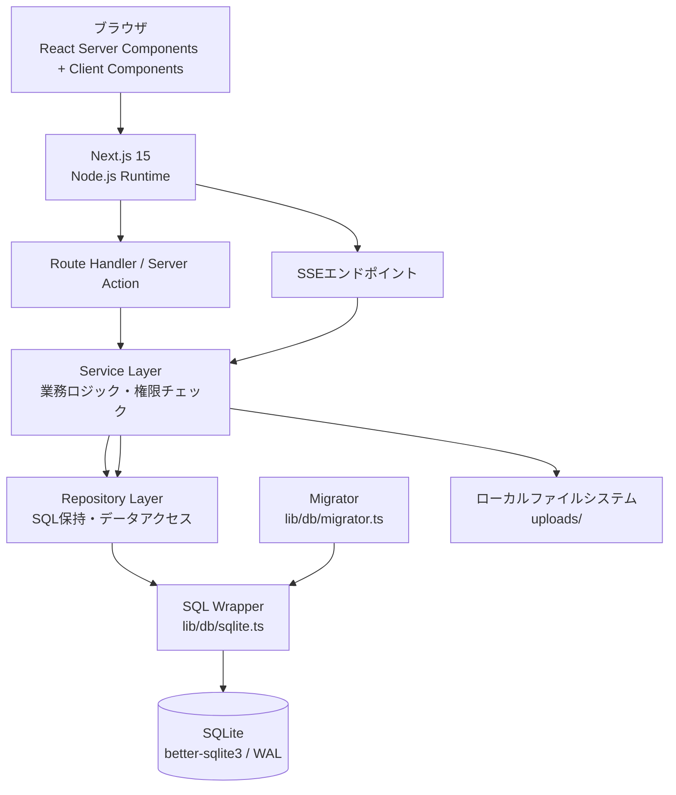
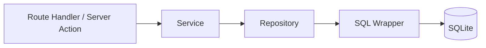
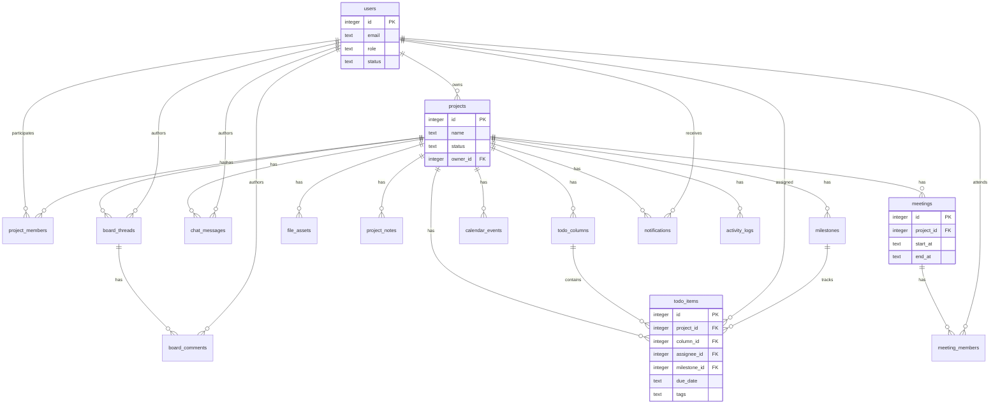
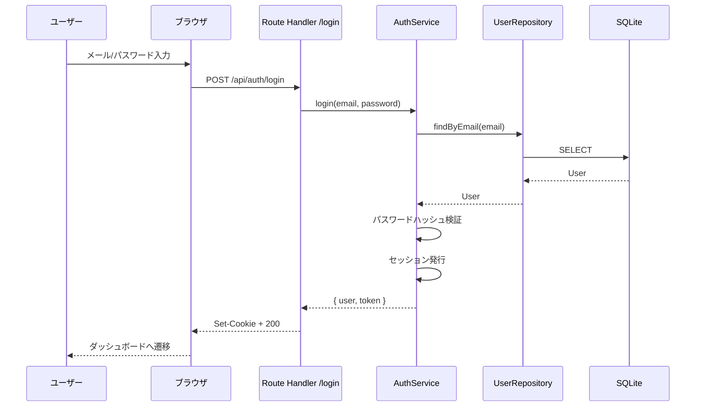
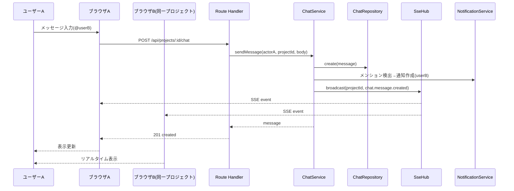
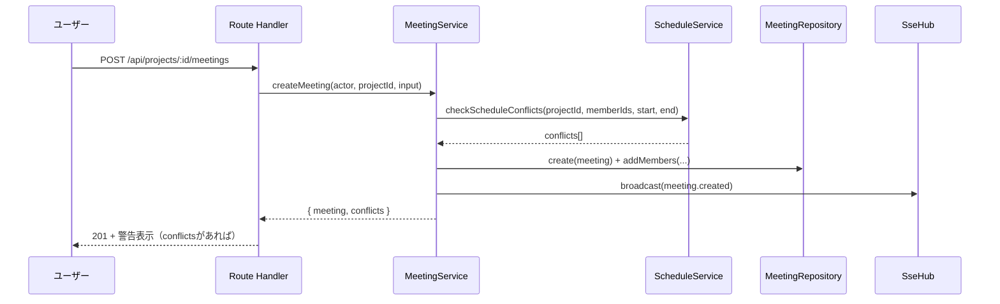
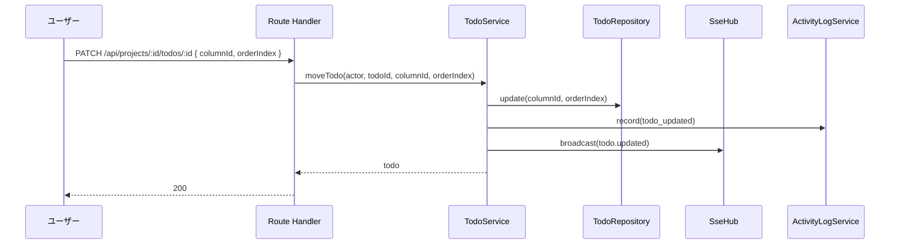
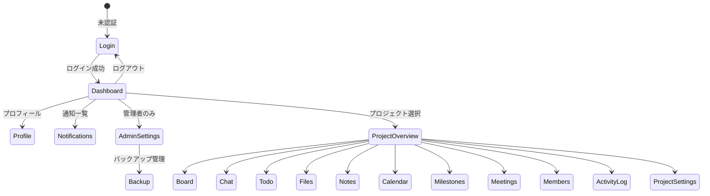

# 機能設計書 (Functional Design Document)

> 本書は `docs/product-requirements.md` で定義された「何を作るか」を「どのように実現するか」に翻訳した機能設計書である。

## システムアーキテクチャ図

### 全体構成



### DBアクセスフロー



- 各Repositoryは直接SQLiteライブラリを触らず、必ず共通SQLラッパー（`lib/db/sqlite.ts`）を通してSQLを実行する。
- Service層は業務ロジック・権限チェック・トランザクション境界を担う。
- すべてNode.js Runtimeで実行する（Edge Runtimeは使用しない）。

## 技術スタック

| カテゴリ | 技術 | 選定理由 |
|------|------|----------|
| 言語 | TypeScript | 型安全性と保守性 |
| フレームワーク | Next.js 15 | App Router・Server Components・Route Handlers・Server Actionsを活用 |
| ランタイム | Node.js Runtime | SQLite(better-sqlite3)直接操作のためEdge Runtime不使用 |
| データベース | SQLite | 外部DB不要・自己完結・小規模チーム向け |
| SQLiteライブラリ | better-sqlite3 | 同期APIで扱いやすく高速 |
| DBアクセス | 独自SQLラッパー + Repositoryクラス | Prisma不使用・SQLを直接制御 |
| Migration | 独自SQL Migration | ファイル名順実行・トランザクション保証 |
| 認証 | 独自ログイン方式 | セッションベース・外部IdP非依存 |
| リアルタイム通信 | SSE (Server-Sent Events) | WebSocket不要・プロジェクト単位配信 |
| ファイル保存 | ローカルファイルシステム | 外部ストレージ不要・自己完結 |
| UI | Tailwind CSS | ユーティリティファーストで高速なUI構築 |
| Markdown表示 | react-markdown + remark-gfm + rehype-sanitize | GFM対応・HTML無効化・サニタイズ |
| ファイル閲覧 | Lightbox UI | 画像・PDFのプレビュー |
| カレンダーUI | FullCalendar系 または 独自実装 | 月/週/日/リスト表示 |
| Unit Test | Vitest | Viteベース・高速 |
| E2E Test | Playwright | 実ブラウザ操作の検証 |

## データモデル定義

### エンティティ一覧

全16テーブル＋管理テーブル1（`schema_migrations`）。タイムスタンプはISO8601文字列（`TEXT`）で保存する。論理削除は `deleted_at TEXT`（NULL=未削除）で表現する。真偽値は `INTEGER`（0/1）で保存する。

### users

```typescript
interface User {
  id: number;                  // PK AUTOINCREMENT
  name: string;                // 表示名（1-100文字）
  email: string;               // 一意・ログインID
  passwordHash: string | null;  // bcrypt等でハッシュ化
  avatarUrl: string | null;     // アイコン画像URL
  role: UserRole;               // 'system_admin' | 'project_admin' | 'member' | 'guest'
  status: UserStatus;           // 'active' | 'inactive'
  createdAt: string;            // ISO8601
  updatedAt: string;            // ISO8601
}
type UserRole = 'system_admin' | 'project_admin' | 'member' | 'guest';
type UserStatus = 'active' | 'inactive';
```

**制約**: emailは一意。passwordHashは平文保存しない。status='inactive'はログイン不可。

### projects

```typescript
interface Project {
  id: number;
  name: string;                 // 1-200文字
  description: string | null;
  status: ProjectStatus;        // 'active' | 'on_hold' | 'completed' | 'archived'
  ownerId: number;              // FK users.id
  createdAt: string;
  updatedAt: string;
}
type ProjectStatus = 'active' | 'on_hold' | 'completed' | 'archived';
```

### project_members

```typescript
interface ProjectMember {
  id: number;
  projectId: number;            // FK projects.id ON DELETE CASCADE
  userId: number;               // FK users.id ON DELETE CASCADE
  role: ProjectMemberRole;      // 'admin' | 'member' | 'guest'
  joinedAt: string;
}
type ProjectMemberRole = 'admin' | 'member' | 'guest';
```

**制約**: UNIQUE(project_id, user_id)。

### board_threads

```typescript
interface BoardThread {
  id: number;
  projectId: number;            // FK projects.id ON DELETE CASCADE
  title: string;                // 1-200文字
  bodyMd: string;               // Markdown本文
  authorId: number;             // FK users.id
  category: BoardCategory | null;
  isPinned: number;             // 0/1
  isImportant: number;          // 0/1
  createdAt: string;
  updatedAt: string;
  deletedAt: string | null;     // 論理削除
}
type BoardCategory = 'notice' | 'spec' | 'minutes' | 'question' | 'decision' | 'trouble' | 'memo';
```

### board_comments

```typescript
interface BoardComment {
  id: number;
  threadId: number;             // FK board_threads.id ON DELETE CASCADE
  authorId: number;             // FK users.id
  bodyMd: string;
  createdAt: string;
  updatedAt: string;
  deletedAt: string | null;
}
```

### chat_messages

```typescript
interface ChatMessage {
  id: number;
  projectId: number;            // FK projects.id ON DELETE CASCADE
  authorId: number;             // FK users.id
  body: string;                 // プレーンテキスト想定（メンション@含む）
  createdAt: string;
  updatedAt: string;
  deletedAt: string | null;
}
```

### todo_columns

```typescript
interface TodoColumn {
  id: number;
  projectId: number;            // FK projects.id ON DELETE CASCADE
  name: string;
  orderIndex: number;
  createdAt: string;
  updatedAt: string;
}
```

### todo_items

```typescript
interface TodoItem {
  id: number;
  projectId: number;            // FK projects.id ON DELETE CASCADE
  columnId: number;             // FK todo_columns.id ON DELETE CASCADE
  title: string;                // 1-200文字
  description: string | null;
  assigneeId: number | null;    // FK users.id
  creatorId: number;            // FK users.id
  priority: TodoPriority;       // 'low' | 'normal' | 'high'
  startDate: string | null;     // ISO8601 date
  dueDate: string | null;       // ISO8601 date
  completedAt: string | null;
  orderIndex: number;
  milestoneId: number | null;   // FK milestones.id
  tags: string | null;          // カンマ区切りのタグ(project_notes.tags と同じ方式)
  createdAt: string;
  updatedAt: string;
  deletedAt: string | null;
}
type TodoPriority = 'low' | 'normal' | 'high';
```

### file_assets

```typescript
interface FileAsset {
  id: number;
  projectId: number;            // FK projects.id ON DELETE CASCADE
  uploaderId: number;           // FK users.id
  filename: string;             // 保存ファイル名（一意）
  originalName: string;         // 元ファイル名
  mimeType: string;             // MIMEタイプ（アップロード時チェック）
  size: number;                 // バイト数
  path: string;                 // ローカルパス（uploads/...）
  source: FileAssetSource;      // 'library'(Files一覧公開) | 'attachment'(添付専用)
  createdAt: string;
  deletedAt: string | null;
}
type FileAssetSource = 'library' | 'attachment';
```

### attachments

```typescript
// file_assets とチャット/掲示板/ToDo を多対多で紐付ける
interface Attachment {
  id: number;
  projectId: number;            // FK projects.id ON DELETE CASCADE
  fileId: number;               // FK file_assets.id
  targetType: AttachmentTargetType;
  targetId: number;             // targetType に応じた chat_message/board_thread/board_comment/todo_item の id
  createdAt: string;
  deletedAt: string | null;
}
type AttachmentTargetType =
  | 'chat_message'
  | 'board_thread'
  | 'board_comment'
  | 'todo_item';
```

### project_notes

```typescript
interface ProjectNote {
  id: number;
  projectId: number;            // FK projects.id ON DELETE CASCADE
  title: string;                // 1-200文字
  bodyMd: string;               // Markdown本文
  tags: string | null;          // カンマ区切り
  isPinned: number;             // 0/1
  createdById: number;          // FK users.id
  updatedById: number;          // FK users.id
  createdAt: string;
  updatedAt: string;
  deletedAt: string | null;
}
```

**インデックス**: `idx_project_notes_project_id(project_id)`, `idx_project_notes_updated_at(updated_at)`。

### milestones

```typescript
interface Milestone {
  id: number;
  projectId: number;            // FK projects.id ON DELETE CASCADE
  title: string;
  description: string | null;
  dueDate: string | null;       // ISO8601 date
  status: MilestoneStatus;      // 'open' | 'closed'
  createdAt: string;
  updatedAt: string;
  deletedAt: string | null;
}
type MilestoneStatus = 'open' | 'closed';
```

### calendar_events

```typescript
interface CalendarEvent {
  id: number;
  projectId: number;            // FK projects.id ON DELETE CASCADE
  title: string;
  description: string | null;
  type: CalendarEventType;      // 'meeting' | 'deadline' | 'milestone' | 'todo' | 'reminder' | 'custom'
  startAt: string;              // ISO8601 datetime
  endAt: string | null;
  createdById: number;          // FK users.id
  relatedTodoId: number | null;
  relatedMilestoneId: number | null;
  relatedMeetingId: number | null;
  createdAt: string;
  updatedAt: string;
  deletedAt: string | null;
}
type CalendarEventType = 'meeting' | 'deadline' | 'milestone' | 'todo' | 'reminder' | 'custom';
```

### meetings

```typescript
interface Meeting {
  id: number;
  projectId: number;            // FK projects.id ON DELETE CASCADE
  title: string;
  description: string | null;
  location: string | null;
  meetingUrl: string | null;
  startAt: string;              // ISO8601 datetime
  endAt: string;                // ISO8601 datetime
  agendaMd: string | null;      // アジェンダ（Markdown）
  minutesMd: string | null;     // 議事録（Markdown）
  createdById: number;          // FK users.id
  createdAt: string;
  updatedAt: string;
  deletedAt: string | null;
}
```

### meeting_members

```typescript
interface MeetingMember {
  id: number;
  meetingId: number;            // FK meetings.id ON DELETE CASCADE
  userId: number;               // FK users.id
  status: MeetingMemberStatus;  // 'invited' | 'accepted' | 'declined'
}
type MeetingMemberStatus = 'invited' | 'accepted' | 'declined';
```

**制約**: UNIQUE(meeting_id, user_id)。

### notifications

```typescript
interface Notification {
  id: number;
  userId: number;               // FK users.id ON DELETE CASCADE
  projectId: number | null;     // FK projects.id ON DELETE CASCADE
  type: NotificationType;
  title: string;
  body: string | null;
  readAt: string | null;        // NULL=未読
  createdAt: string;
}
type NotificationType =
  | 'mention' | 'todo_assigned' | 'todo_due_soon'
  | 'meeting_invited' | 'board_commented' | 'project_added'
  | 'file_shared' | 'note_updated';
```

### activity_logs

```typescript
interface ActivityLog {
  id: number;
  projectId: number;            // FK projects.id ON DELETE CASCADE
  actorId: number;              // FK users.id
  action: string;               // 'todo_created' | 'file_uploaded' 等
  targetType: string;           // 'todo' | 'file' | 'thread' 等
  targetId: number | null;
  metadataJson: string | null;  // JSON文字列
  createdAt: string;
}
```

### schema_migrations（管理テーブル）

```typescript
interface SchemaMigration {
  id: number;
  filename: string;             // 一意
  appliedAt: string;            // ISO8601
}
```

### ER図



## コンポーネント設計

### SQLラッパー: `lib/db/sqlite.ts`

**責務**: SQLite接続の共通管理・SELECT/INSERT/UPDATE/DELETE・トランザクション・初期設定・エラー処理。

```typescript
export type SqlParams = Record<string, unknown> | unknown[];

export class SqliteDatabase {
  constructor(dbPath: string);         // journal_mode=WAL, foreign_keys=ON を設定
  query<T>(sql: string, params?: SqlParams): T[];
  get<T>(sql: string, params?: SqlParams): T | null;
  execute(sql: string, params?: SqlParams): { changes: number; lastInsertRowid: number | bigint };
  transaction<T>(callback: () => T): T;
  close(): void;
}

export function getDb(): SqliteDatabase;  // シングルトン。dbPath = process.env.SQLITE_PATH ?? "./data/app.db"
```

**依存**: better-sqlite3。

### Migrator: `lib/db/migrator.ts`

**責務**: Migrationファイルをファイル名順に実行・実行済み管理・トランザクション・失敗時ロールバック。

```typescript
export class Migrator {
  constructor(db: SqliteDatabase, migrationsDir: string);
  migrate(): void;   // schema_migrations作成→未適用ファイルを順に1ファイル1トランザクションで実行
}
```

### Repository層

各テーブルごとにRepositoryクラスを作成する。RepositoryはSQLを直接保持し、SQLラッパー経由で実行する。論理削除テーブルは取得時に `deleted_at IS NULL` を必ず付与する。

```typescript
// 共通インターフェース例
interface UserRepository {
  findById(id: number): User | null;
  findByEmail(email: string): User | null;
  create(data: { name: string; email: string; passwordHash: string; role?: UserRole }): User;
  update(id: number, data: Partial<Pick<User, 'name' | 'avatarUrl' | 'role' | 'status'>>): User | null;
}

interface ProjectRepository {
  findById(id: number): Project | null;
  findByOwner(ownerId: number): Project[];
  create(data: { name: string; description?: string; ownerId: number }): Project;
  update(id: number, data: Partial<Pick<Project, 'name' | 'description' | 'status'>>): Project | null;
  delete(id: number): boolean;
}

interface ProjectMemberRepository {
  findByProject(projectId: number): (ProjectMember & { user?: User })[];
  findByUser(userId: number): (ProjectMember & { project?: Project })[];
  add(projectId: number, userId: number, role: ProjectMemberRole): ProjectMember;
  remove(projectId: number, userId: number): boolean;
  isMember(projectId: number, userId: number): boolean;
  getRole(projectId: number, userId: number): ProjectMemberRole | null;
}

interface BoardRepository { /* thread/comment CRUD + 検索 + ページネーション */ }
interface ChatRepository { /* message CRUD + ページネーション + 検索 */ }
interface TodoRepository { /* column/item CRUD + 並び替え + ページネーション */ }
interface FileRepository { /* asset CRUD + フォルダ */ }
interface CalendarRepository { /* event CRUD + 期間検索 */ }
interface MeetingRepository { /* meeting/member CRUD */ }
interface ProjectNoteRepository { /* note CRUD + 検索 + ピン留め */ }
interface NotificationRepository { /* 作成・未読一覧・既読化 */ }
interface ActivityLogRepository { /* 作成・一覧 */ }
interface MilestoneRepository { /* CRUD + 関連ToDo取得 */ }
```

**Repository一覧**: UserRepository, ProjectRepository, ProjectMemberRepository, BoardRepository, ChatRepository, TodoRepository, FileRepository, CalendarRepository, MeetingRepository, ProjectNoteRepository, NotificationRepository, ActivityLogRepository, MilestoneRepository。

### Service層

業務ロジック・権限チェック・トランザクション境界・副作用（通知生成・アクティビティログ記録・SSE配信）を担う。

```typescript
interface AuthService {
  register(input: { name: string; email: string; password: string }): User;
  login(email: string, password: string): { user: User; token: string };
  logout(): void;
  getCurrentUser(): User | null;
  updateProfile(userId: number, input: Partial<{ name: string; avatarUrl: string; email: string }>): User;
}

interface ProjectService {
  createProject(actorId: number, input: { name: string; description?: string }): Project;
  updateProject(actorId: number, projectId: number, input: Partial<{ name: string; description: string; status: string }>): Project;
  addMember(actorId: number, projectId: number, userId: number, role: ProjectMemberRole): void;  // 権限チェック・通知
  removeMember(actorId: number, projectId: number, userId: number): void;
  archiveProject(actorId: number, projectId: number): void;
  getDashboard(projectId: number, userId: number): ProjectDashboard;
}

interface ChatService {
  sendMessage(actorId: number, projectId: number, body: string): ChatMessage;  // SSE配信 + メンション通知
  editMessage(actorId: number, messageId: number, body: string): ChatMessage;
  deleteMessage(actorId: number, messageId: number): void;
  getHistory(projectId: number, page: number): { items: ChatMessage[]; total: number };
}

interface MeetingService {
  createMeeting(actorId: number, projectId: number, input: MeetingInput): { meeting: Meeting; conflicts: ScheduleConflict[] };
  checkScheduleConflicts(projectId: number, memberIds: number[], startAt: string, endAt: string, excludeMeetingId?: number): ScheduleConflict[];
  updateMinutes(actorId: number, meetingId: number, minutesMd: string): Meeting;
}

interface ScheduleService {
  getCalendarEvents(projectId: number, range: { from: string; to: string }, filters?: CalendarFilters): CalendarEventView[];
}

interface FileStorageService {
  upload(actorId: number, projectId: number, file: File): FileAsset;  // MIMEチェック・保存・アクティビティログ
  getDownloadStream(fileAssetId: number, userId: number): ReadableStream;
  delete(actorId: number, fileAssetId: number): void;
}

interface BackupService {
  createBackup(actorId: number): { filename: string; path: string };  // DB+uploadsをZIP化
  listBackups(): BackupFile[];
  downloadBackup(actorId: number, filename: string): ReadableStream;
}
```

**Service一覧**: AuthService, ProjectService, ChatService, MeetingService, ScheduleService, FileStorageService, BackupService。

### SSE配信基盤: `lib/sse/`

**責務**: プロジェクト単位のSSEクライアント管理・イベント配信・自動再接続対応。

```typescript
// プロジェクト別のクライアント集合を管理
class SseHub {
  addClient(projectId: number, res: ServerResponse): void;
  removeClient(projectId: number, res: ServerResponse): void;
  broadcast(projectId: number, event: SseEvent): void;  // 当該プロジェクトの全クライアントへ配信
}
type SseEvent =
  | { type: 'chat.message.created'; data: ChatMessage }
  | { type: 'chat.message.updated'; data: ChatMessage }
  | { type: 'chat.message.deleted'; data: { id: number } }
  | { type: 'todo.updated'; data: TodoItem }
  | { type: 'file.uploaded'; data: FileAsset }
  | { type: 'meeting.created'; data: Meeting }
  | { type: 'note.updated'; data: ProjectNote }
  | { type: 'notification.created'; data: Notification };
```

## ユースケース図（シーケンス）

### ユースケース1: ログイン



### ユースケース2: チャットメッセージ送信（SSE配信）



### ユースケース3: ミーティング作成（予定重複チェック）



### ユースケース4: ToDoドラッグ&ドロップ移動



## 画面遷移図



### 共通画面
- ログイン画面・ダッシュボード・通知一覧・ユーザープロフィール・管理者設定・バックアップ管理

### プロジェクト内画面
- プロジェクト概要・掲示板・チャット・ToDo/Kanban・ファイル・Markdownメモ・カレンダー・マイルストーン・ミーティング・メンバー・アクティビティログ・設定

## API設計

Route Handlerベース。全エンドポイントで認証必須（`/api/auth/*`除く）。プロジェクト系エンドポイントは参加者権限チェックを行う。ページネーションは `?page=1&pageSize=20`。

### 認証

| メソッド | パス | 説明 |
|------|------|------|
| POST | `/api/auth/register` | ユーザー登録 |
| POST | `/api/auth/login` | ログイン |
| POST | `/api/auth/logout` | ログアウト |
| GET | `/api/auth/me` | 現在のユーザー |
| PATCH | `/api/users/me` | プロフィール編集 |

### プロジェクト

| メソッド | パス | 説明 |
|------|------|------|
| GET | `/api/projects` | 自分の参加プロジェクト一覧 |
| POST | `/api/projects` | プロジェクト作成 |
| GET | `/api/projects/:projectId` | プロジェクト詳細/ダッシュボード |
| PATCH | `/api/projects/:projectId` | プロジェクト編集 |
| DELETE | `/api/projects/:projectId` | プロジェクト削除 |
| GET | `/api/projects/:projectId/members` | メンバー一覧 |
| POST | `/api/projects/:projectId/members` | メンバー追加 |
| DELETE | `/api/projects/:projectId/members/:userId` | メンバー削除 |

### 掲示板

| メソッド | パス | 説明 |
|------|------|------|
| GET | `/api/projects/:projectId/board/threads` | スレッド一覧（ページネーション・検索） |
| POST | `/api/projects/:projectId/board/threads` | スレッド作成 |
| GET | `/api/projects/:projectId/board/threads/:threadId` | スレッド詳細 |
| PATCH | `/api/projects/:projectId/board/threads/:threadId` | スレッド編集 |
| DELETE | `/api/projects/:projectId/board/threads/:threadId` | スレッド削除 |
| POST | `/api/projects/:projectId/board/threads/:threadId/comments` | コメント作成 |
| PATCH | `/api/projects/:projectId/board/comments/:commentId` | コメント編集 |
| DELETE | `/api/projects/:projectId/board/comments/:commentId` | コメント削除 |

### チャット

| メソッド | パス | 説明 |
|------|------|------|
| GET | `/api/projects/:projectId/chat/messages` | 履歴（ページネーション・検索） |
| POST | `/api/projects/:projectId/chat/messages` | メッセージ送信 |
| PATCH | `/api/projects/:projectId/chat/messages/:messageId` | メッセージ編集 |
| DELETE | `/api/projects/:projectId/chat/messages/:messageId` | メッセージ削除 |
| GET | `/api/projects/:projectId/chat/stream` | **SSEエンドポイント**（プロジェクト別） |

### ToDo / Kanban

| メソッド | パス | 説明 |
|------|------|------|
| GET | `/api/projects/:projectId/todos/columns` | カラム一覧 |
| POST | `/api/projects/:projectId/todos/columns` | カラム作成 |
| PATCH | `/api/projects/:projectId/todos/columns/:columnId` | カラム編集/並び替え |
| DELETE | `/api/projects/:projectId/todos/columns/:columnId` | カラム削除 |
| GET | `/api/projects/:projectId/todos/items` | タスク一覧 |
| POST | `/api/projects/:projectId/todos/items` | タスク作成 |
| PATCH | `/api/projects/:projectId/todos/items/:itemId` | タスク編集/移動 |
| DELETE | `/api/projects/:projectId/todos/items/:itemId` | タスク削除 |

### ファイル

| メソッド | パス | 説明 |
|------|------|------|
| GET | `/api/projects/:projectId/files` | ファイル一覧 |
| POST | `/api/projects/:projectId/files` | アップロード（multipart） |
| GET | `/api/files/:fileId/download` | ダウンロード（権限チェック） |
| DELETE | `/api/files/:fileId` | 削除 |

### Markdownメモ

| メソッド | パス | 説明 |
|------|------|------|
| GET | `/api/projects/:projectId/notes` | メモ一覧（検索・ページネーション） |
| POST | `/api/projects/:projectId/notes` | メモ作成 |
| GET | `/api/projects/:projectId/notes/:noteId` | メモ詳細 |
| PATCH | `/api/projects/:projectId/notes/:noteId` | メモ編集 |
| DELETE | `/api/projects/:projectId/notes/:noteId` | メモ削除 |

### カレンダー / マイルストーン / ミーティング

| メソッド | パス | 説明 |
|------|------|------|
| GET | `/api/projects/:projectId/calendar/events` | イベント一覧（期間・フィルタ） |
| POST | `/api/projects/:projectId/calendar/events` | イベント作成 |
| PATCH | `/api/projects/:projectId/calendar/events/:eventId` | 編集 |
| DELETE | `/api/projects/:projectId/calendar/events/:eventId` | 削除 |
| GET | `/api/projects/:projectId/milestones` | マイルストーン一覧 |
| POST | `/api/projects/:projectId/milestones` | 作成 |
| PATCH | `/api/projects/:projectId/milestones/:id` | 編集 |
| GET | `/api/projects/:projectId/milestones/:id/progress` | 進捗率取得 |
| GET | `/api/projects/:projectId/meetings` | ミーティング一覧 |
| POST | `/api/projects/:projectId/meetings` | 作成（conflicts返却） |
| PATCH | `/api/projects/:projectId/meetings/:id` | 編集 |
| POST | `/api/projects/:projectId/meetings/check` | 予定重複チェックのみ |

### 通知 / アクティビティ / 検索 / バックアップ / Migration

| メソッド | パス | 説明 |
|------|------|------|
| GET | `/api/notifications` | 未読通知一覧 |
| POST | `/api/notifications/:id/read` | 既読化 |
| GET | `/api/projects/:projectId/activity` | アクティビティログ一覧 |
| GET | `/api/projects/:projectId/search` | 横断検索 |
| GET | `/api/admin/backups` | バックアップ一覧（管理者） |
| POST | `/api/admin/backups` | バックアップ作成（管理者） |
| GET | `/api/admin/backups/:filename` | ダウンロード（管理者） |
| GET | `/api/admin/migrations` | Migration状態確認（管理者） |

### エラーレスポンス

```
400 Bad Request: バリデーションエラー・必須項目不足
401 Unauthorized: 未認証
403 Forbidden: 権限不足（プロジェクト非参加者・管理者機能への非管理者アクセス）
404 Not Found: リソース不存在・論理削除済み
409 Conflict: 一意制約違反（email重複等）
500 Internal Server Error: サーバー内部エラー
```

エラーレスポンス本文:
```json
{ "error": { "code": "VALIDATION_ERROR", "message": "タイトルは1-200文字で入力してください" } }
```

## アルゴリズム設計

### アルゴリズム1: スケジュール重複判定

**目的**: ミーティング作成時、選択された参加メンバーの予定重複を検出する。

**入力**: `projectId`, `memberIds: number[]`, `startAt: string`, `endAt: string`, `excludeMeetingId?: number`

**判定対象**:
1. 他のミーティング（meeting_members経由で該当ユーザーが参加、かつ時間重複）
2. カレンダーイベント（該当ユーザーが作成者、かつ時間重複）
3. 期限の近い重要タスク（該当ユーザーが担当、priority='high'、dueDateが会議日±3日以内）

**時間重複判定**: `NOT (existing.end <= new.start OR existing.start >= new.end)`

```typescript
interface ScheduleConflict {
  userId: number;
  type: 'meeting' | 'calendar_event' | 'important_todo';
  refId: number;
  title: string;
  startAt: string;
  endAt: string | null;
}

function checkScheduleConflicts(
  projectId: number,
  memberIds: number[],
  startAt: string,
  endAt: string,
  excludeMeetingId?: number
): ScheduleConflict[] {
  const conflicts: ScheduleConflict[] = [];
  const newStart = new Date(startAt).getTime();
  const newEnd = new Date(endAt).getTime();

  for (const userId of memberIds) {
    // 1. 他ミーティング
    const meetings = meetingRepo.findUpcomingByUser(userId, newStart, newEnd, excludeMeetingId);
    for (const m of meetings) {
      if (overlaps(newStart, newEnd, m.startAt, m.endAt)) {
        conflicts.push({ userId, type: 'meeting', refId: m.id, title: m.title, startAt: m.startAt, endAt: m.endAt });
      }
    }
    // 2. カレンダーイベント
    const events = calendarRepo.findByUserInRange(userId, newStart, newEnd);
    for (const e of events) {
      if (e.endAt && overlaps(newStart, newEnd, e.startAt, e.endAt)) {
        conflicts.push({ userId, type: 'calendar_event', refId: e.id, title: e.title, startAt: e.startAt, endAt: e.endAt });
      }
    }
    // 3. 期限の近い重要タスク（±3日）
    const todos = todoRepo.findHighPriorityByAssignee(userId, dayRange(startAt, 3));
    for (const t of todos) {
      conflicts.push({ userId, type: 'important_todo', refId: t.id, title: t.title, startAt: t.dueDate!, endAt: null });
    }
  }
  return conflicts;
}

function overlaps(s1: number, e1: number, s2: string, e2: string): boolean {
  const start2 = new Date(s2).getTime();
  const end2 = new Date(e2).getTime();
  return !(end2 <= s1 || start2 >= e1);
}
```

**出力**: 重複があれば警告として返却（作成自体はブロックしない）。

### アルゴリズム2: マイルストーン進捗率自動計算

**目的**: 関連ToDoの完了率から進捗率を自動計算する。

```typescript
function calcMilestoneProgress(milestoneId: number): number {
  const todos = todoRepo.findByMilestone(milestoneId);  // deleted_at IS NULL
  if (todos.length === 0) return 0;
  const completed = todos.filter((t) => t.completedAt !== null).length;
  return Math.round((completed / todos.length) * 100);
}
```

**出力**: 0-100（整数）。

### アルゴリズム3: 通知作成ロジック

**目的**: 各イベント発生時に、適切な対象ユーザーへ通知を作成する。

```typescript
function notifyOnEvent(event: NotificationEvent): void {
  const targets = resolveTargets(event);  // イベント種別→対象ユーザー集合
  for (const userId of targets) {
    notificationRepo.create({
      userId,
      projectId: event.projectId,
      type: event.type,
      title: event.title,
      body: event.body,
    });
    sseHub.broadcast(event.projectId, { type: 'notification.created', data: ... });
  }
}

function resolveTargets(event: NotificationEvent): number[] {
  switch (event.type) {
    case 'mention':            return [event.mentionedUserId];
    case 'todo_assigned':      return [event.assigneeId];
    case 'todo_due_soon':      return [event.assigneeId];
    case 'meeting_invited':    return event.memberIds;
    case 'board_commented':    return [event.threadAuthorId];
    case 'project_added':      return [event.addedUserId];
    case 'file_shared':        return event.projectMemberIds;
    case 'note_updated':       return event.projectMemberIds;
  }
}
```

### アルゴリズム4: アクティビティログ作成ロジック

**目的**: 変更操作をプロジェクト単位の時系列ログとして記録する。

```typescript
function logActivity(input: {
  projectId: number;
  actorId: number;
  action: string;          // 'todo_created' | 'file_uploaded' | ...
  targetType: string;      // 'todo' | 'file' | 'thread' | ...
  targetId: number;
  metadata?: Record<string, unknown>;
}): void {
  activityLogRepo.create({
    projectId: input.projectId,
    actorId: input.actorId,
    action: input.action,
    targetType: input.targetType,
    targetId: input.targetId,
    metadataJson: input.metadata ? JSON.stringify(input.metadata) : null,
  });
}
```

**記録対象操作**: todo_created, todo_updated, todo_completed, file_uploaded, board_posted, comment_added, note_created, note_updated, meeting_created, member_added, milestone_updated。

## UI設計

### プロジェクトダッシュボード表示項目

| 項目 | 説明 | フォーマット |
|------|------|------|
| 最新チャット | 直近5件 | メッセージ + 投稿者 + 相対時間 |
| 最新掲示板 | ピン留め優先・直近5件 | タイトル + カテゴリ + 相対時間 |
| 最新Markdownメモ | ピン留め優先・直近5件 | タイトル + 更新者 + 相対時間 |
| 未完了ToDo | 進行中タスク | タイトル + 担当者 + 期限 |
| 期限が近いToDo | 7日以内 | 期限順ソート |
| 次回ミーティング | 直近1件 | タイトル + 開始日時 + 参加者 |
| 直近マイルストーン | 進捗率付き | タイトル + 期限 + 進捗バー |
| 最近のファイル | 直近5件 | ファイル名 + サイズ + 相対時間 |
| 最近のアクティビティ | 直近10件 | アクター + アクション + 相対時間 |

### カラーコーディング

- プロジェクトステータス: Active=緑 / On Hold=黄 / Completed=青 / Archived=グレー
- ToDo優先度: high=赤 / normal=黄 / low=グレー
- 通知: 未読=強調 / 既読=通常
- マイルストーン進捗: 0-33%=赤 / 34-66%=黄 / 67-100%=緑

### Kanban操作

1. カラムは横並び・ドラッグで並び替え
2. タスクはドラッグ&ドロップでカラム間移動
3. 移動時にorderIndexを再計算

## ファイル構造

### データ保存構成

```
./data/
├── app.db                  # SQLite DBファイル
└── uploads/                # アップロードファイル
    └── <projectId>/
        └── <filename>      # 一意な保存名

./lib/db/migrations/
├── 001_initial.sql         # 初期スキーマ
└── ...

./backups/                  # バックアップZIP
└── backup-<timestamp>.zip
```

### uploadsの保存命名

- 保存ファイル名: `<uuid>.<ext>`（衝突回避）
- `file_assets.path` に相対パスを保存
- 元ファイル名は `original_name` に保存

## パフォーマンス最適化

- **ページネーション**: 掲示板・チャット履歴・ファイル一覧・Markdownメモ・アクティビティログは必ずページネーションし必要件数のみ取得
- **インデックス**: `project_notes(project_id)`, `project_notes(updated_at)` 等の検索頻度高いカラムにインデックス付与
- **WALモード**: SQLite を WAL モードで運用し読み書きの並行性を向上
- **SSE接続**: プロジェクト単位でクライアント集合を管理し、配信は当該プロジェクトのみ（他プロジェクトへ漏れさせない）
- **Server Components**: 可能な限りServer Componentsでデータ取得しクライアント送信量を削減

## セキュリティ考慮事項

- **認証**: 全保護画面・APIで認証必須
- **認可**: プロジェクト参加者以外はプロジェクト情報・ファイルにアクセス不可（Service層で`isMember`チェック）
- **SQLインジェクション対策**: 全SQLをパラメータバインドで実行（文字列結合禁止）
- **Markdownサニタイズ**: HTML直接入力無効化 + rehype-sanitize でサニタイズ + 危険URLスキーム除外
- **ファイルアップロード**: MIMEタイプチェック・ファイル名サニタイズ・保存名の一意化
- **パスワード**: ハッシュ化保存（平文禁止）
- **管理者機能**: System Admin ロールチェック・操作をアクティビティログに記録

## エラーハンドリング

| エラーカテゴリ | 処理 | ユーザー表示 |
|-----------|------|-----------------|
| 入力バリデーションエラー | 処理中断・400返却 | 「タイトルは1-200文字で入力してください」 |
| 未認証 | リダイレクト/401 | ログイン画面へ遷移 |
| 権限不足 | 処理中断・403 | 「この操作を行う権限がありません」 |
| リソース不存在 | 処理中断・404 | 「リソースが見つかりません」 |
| 一意制約違反 | 処理中断・409 | 「このメールアドレスは既に使用されています」 |
| Migration失敗 | 1ファイルトランザクションでロールバック | 管理者画面にエラー表示 |
| ファイル読み書き失敗 | 処理中断・500 | 「ファイルの保存に失敗しました」 |
| SSE接続切断 | クライアントで自動再接続 | （ユーザー操作不要） |

## テスト戦略

### Unit Test（Vitest）
- SQLラッパー（query/get/execute/transaction）
- Migration（ファイル名順実行・再実行回避・失敗時ロールバック）
- 全Repository（CRUD・論理削除の非取得・プロジェクト分離）
- 全Service（権限チェック・バリデーション）
- スケジュール重複判定アルゴリズム
- 通知作成ロジック（正しいユーザーへ作成）
- アクティビティログ作成ロジック
- マイルストーン進捗率計算

### 統合テスト
- 認証フロー（登録→ログイン→保護画面アクセス）
- プロジェクト作成→メンバー追加→権限分離
- チャット送信→SSE配信

### E2E Test（Playwright）
- 認証・プロジェクト管理・掲示板・チャット（SSEリアルタイム）・ToDo（ドラッグ&ドロップ）・ファイル共有（Lightbox）・Markdownメモ・カレンダー・ミーティング（予定重複警告）・通知・アクティビティログ・バックアップ
- `npm run test:e2e` で実行
